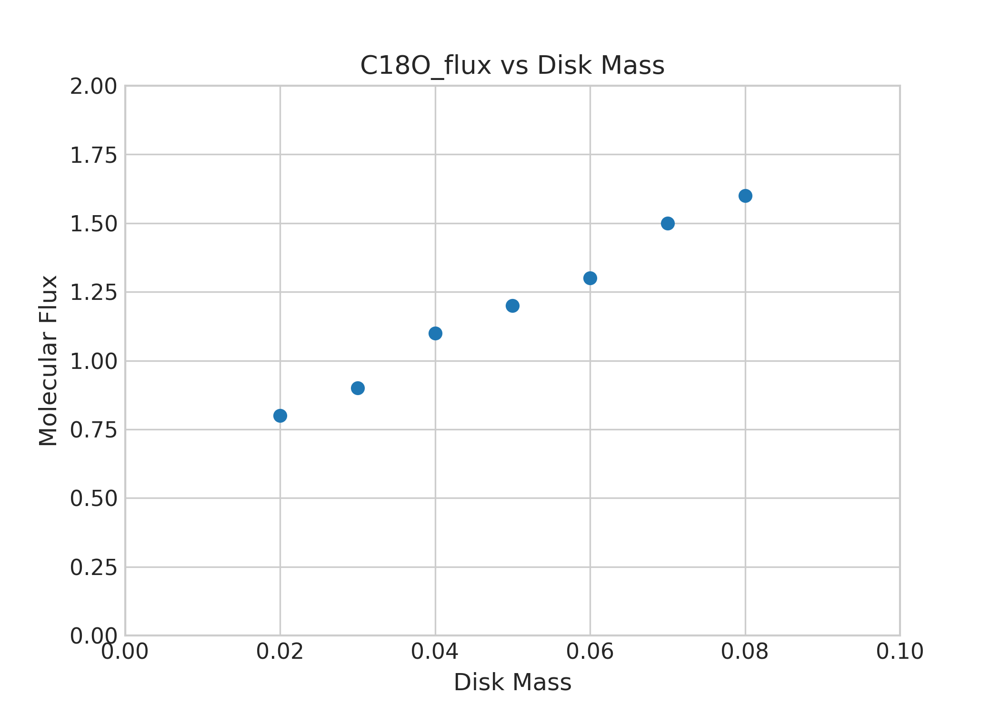
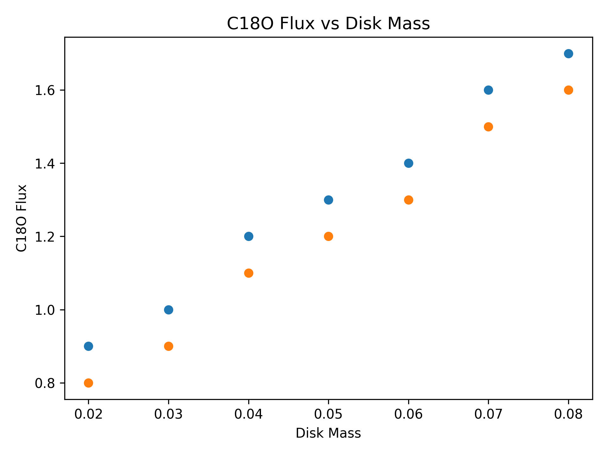

# Statistical Analysis of Molecular Line Observations in Planet-Forming Disks

Planet-forming disks around young stars provide crucial insights into the physical and chemical
conditions that govern planet formation. Molecular line observations at millimeter wavelengths
are a key diagnostic for probing disk structure, mass, and chemical composition.

This project presents a Python-based statistical analysis of molecular line emission data from
planet-forming disks, with the goal of exploring relationships between disk mass and molecular
tracers commonly used in observational studies.

## Scientific Motivation
Molecular species such as C18O, CN, HCN, and HCO⁺ trace different physical and chemical regimes
within protoplanetary disks. Studying how their observed emission varies with disk properties
can help constrain disk mass, temperature structure, and chemical evolution, which are central
questions in planet formation research.

## Methodology
- Loaded molecular line flux data from structured CSV datasets
- Performed descriptive statistical analysis to summarize disk properties
- Investigated correlations between disk mass and molecular line emission
- Visualized trends using publication-style scatter plots
- Produced clean, reproducible outputs suitable for further scientific analysis

## Results
The analysis produces:
- Summary statistics of molecular line fluxes and disk masses
- Individual plots showing molecular line flux versus disk mass
- Clear visual trends that can be qualitatively compared with expectations from disk chemistry models

## Outputs
- Statistical summary tables (CSV)
- Molecular line flux vs. disk mass plots (PNG)

## Tools and Technologies
Python  
Pandas  
Matplotlib  

## Relevance to Research
This project demonstrates hands-on experience with observational-style datasets,
statistical analysis, and scientific visualization. The workflow closely mirrors
the initial data exploration steps commonly performed in studies of
planet-forming disks using facilities such as ALMA and NOEMA.

The skills developed here are directly applicable to data-driven research
in protoplanetary disk chemistry and planet formation.

## Sample Results

### Animated Molecular Line Trends

### Static Summary Plot

